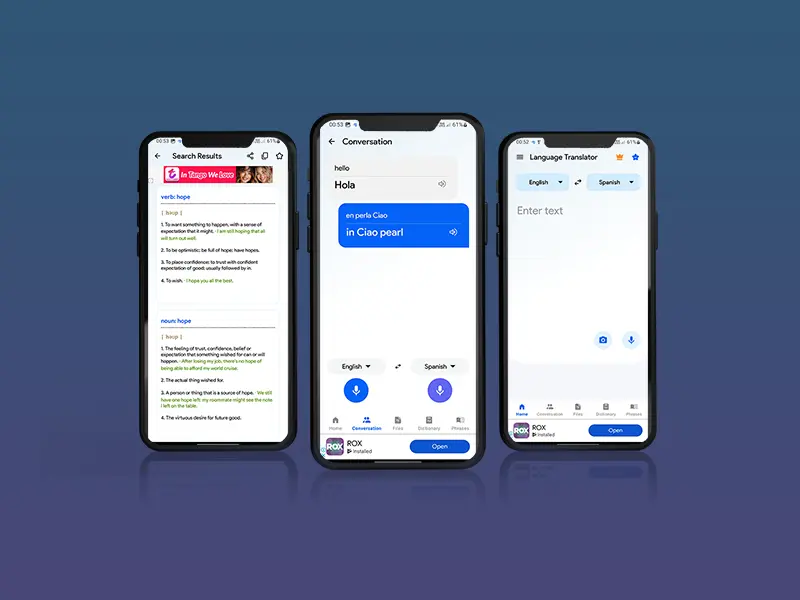

# ✅ Portfolio Website - Action Checklist

## 🎯 What's Done (Completed by AI)

- ✅ Updated portfolio section with 9 real projects
- ✅ Added project descriptions and download counts
- ✅ Completely rewrote experience section with accurate details
- ✅ Updated skills section with modern technologies
- ✅ Added CSS styling for project descriptions
- ✅ Fixed broken HTML structure
- ✅ Updated meta description for SEO
- ✅ Created documentation (this file + others)

---

## 🚀 What You Need to Do

### Priority 1: Images (Required) ⏰

Add these 3 images to `PortfolioWeb/images/portfolio-imgs/`:

- [ ] **ailanguagetranslator.webp** - AI Language Translator screenshot
- [ ] **fastshare.webp** - Fast Share Transfer screenshot  
- [ ] **flashlight.webp** - Bright Flashlight screenshot

**How to get them:**
1. Go to Play Store pages of these apps
2. Download/screenshot the featured graphic
3. Resize to 600x400px
4. Convert to WebP format
5. Save in `images/portfolio-imgs/` folder

**See `IMAGES_NEEDED.md` for detailed instructions.**

---

### Priority 2: Testing (Important) 🧪

- [ ] Open `index.html` in your browser
- [ ] Check if all images load (6 existing + 3 new)
- [ ] Click each Play Store link to verify they work
- [ ] Scroll through all sections (Portfolio, Experience, Education, Skills)
- [ ] Test on mobile device or use browser DevTools
- [ ] Check if project descriptions display nicely

---

### Priority 3: Deployment (When Ready) 🌐

Once images are added and tested:

- [ ] Commit changes to Git
- [ ] Push to GitHub repository
- [ ] Deploy to GitHub Pages (if applicable)
- [ ] Update your LinkedIn profile with portfolio link
- [ ] Share portfolio link on resume/CV

**Git Commands:**
```bash
cd PortfolioWeb
git add .
git commit -m "Updated portfolio with real projects and modern skills"
git push origin main
```

---

## 📝 Optional Improvements (Nice to Have)

### Quick Wins:
- [ ] Add favicon if not already present
- [ ] Add Google Analytics tracking code
- [ ] Update any social media links in footer
- [ ] Add Open Graph meta tags for social sharing

### Future Enhancements:
- [ ] Add blog section with technical articles
- [ ] Include client testimonials
- [ ] Add video demos of apps
- [ ] Create detailed case study pages
- [ ] Add dark mode toggle
- [ ] Implement contact form

---

## 🔍 Verification Checklist

Before going live, verify:

### Content:
- [ ] All project names are correct
- [ ] Play Store links point to correct apps
- [ ] Download counts are accurate
- [ ] Date ranges for experience are correct
- [ ] Company names spelled correctly

### Design:
- [ ] All images load properly
- [ ] Layout looks good on desktop
- [ ] Layout looks good on mobile
- [ ] All links work (GitHub, LinkedIn, StackOverflow)
- [ ] No console errors in browser DevTools

### SEO:
- [ ] Meta description is updated (✅ Done)
- [ ] Page title is descriptive (✅ Done)
- [ ] Images have alt text (✅ Done)
- [ ] Internal links work properly

---

## 📊 Files to Review

| File | Status | Action Needed |
|------|--------|---------------|
| `index.html` | ✅ Updated | Add 3 images, then test |
| `css/styles.css` | ✅ Updated | No action needed |
| `IMAGES_NEEDED.md` | ✅ Created | Read for image guide |
| `UPDATE_SUMMARY.md` | ✅ Created | Read for full details |
| `ACTION_CHECKLIST.md` | ✅ Created | You're reading it! |

---

## 🎨 Image Quick Reference

If you need placeholder images temporarily, use existing ones:

```html
<!-- Temporary placeholder until you get real images -->

```

But get the real images ASAP for authenticity!

---

## 💡 Pro Tips

### For Images:
1. Use actual app screenshots - more authentic
2. Show the most impressive features
3. Keep file sizes under 100KB each
4. Maintain consistent dimensions (600x400px)

### For Testing:
1. Test in multiple browsers (Chrome, Firefox, Safari)
2. Check mobile responsiveness
3. Ask a friend to review for feedback
4. Use Google PageSpeed Insights for performance

### For Deployment:
1. Test locally first
2. Create a backup of old version
3. Deploy during low-traffic times
4. Monitor for any issues post-deployment

---

## 📞 Need Help?

If you encounter any issues:

### Image Issues:
- Check file names match exactly (case-sensitive)
- Verify images are in correct folder
- Try clearing browser cache (Ctrl+Shift+R)

### Layout Issues:
- Check browser console for errors
- Verify all CSS files are loaded
- Test in incognito/private mode

### Link Issues:
- Verify Play Store URLs are correct
- Check social media links still work
- Test external links in new tab

---

## 🎯 Timeline Estimate

- **Adding Images:** 30-60 minutes
- **Testing:** 15-30 minutes
- **Deployment:** 10-15 minutes
- **Total Time:** ~1-2 hours

---

## ✨ Final Step

Once everything is working:

- [ ] Take a screenshot of your updated portfolio
- [ ] Share it on LinkedIn with hashtags: #AndroidDev #Portfolio
- [ ] Update resume with portfolio link
- [ ] Add portfolio link to email signature

---

<p align="center">
  <strong>You're almost there! Just add the images and test! 🚀</strong>
</p>

<p align="center">
  <sub>Estimated completion: 1-2 hours of work</sub>
</p>

